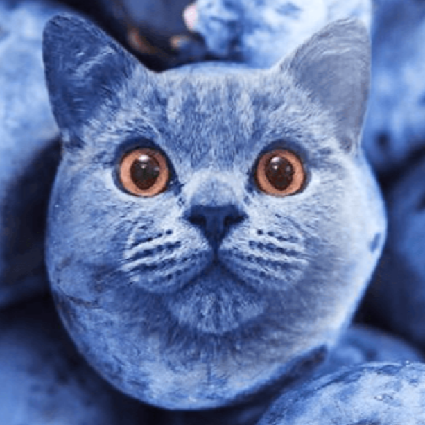

# Berry Blast

Welcome to version 1.0 of Berry Blast.

- Requires Greenfoot
- To play, open the "project.greenfoot" file located in the repository, then press "Run" (Or CTRL/COMMAND + R)
- Select your mode, and instructions will be displayed.

Berry Blast is a platformer game featuring a cat who needs to collect berries. 
The player controls the cat, navigating platforms to collect as many berries as possible.

There are two modes a player can select. One being normal mode and the other being the hard mode.

If a player selects normal mode, they have full control over the cat's movement, and the goal is to collect 15 berries.
However, if the player is up for the challenge, they may choose hard mode, which revokes control of lateral movement, controlled completely automatically. 

In hard mode, you can collect as many berries as possible with no end. It ends when you fall off!

Have fun playing Berry Blast!

